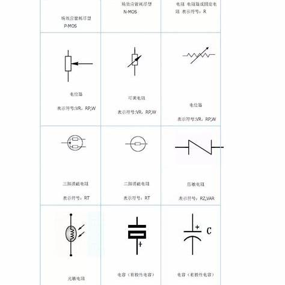

# Circuit Analysis

### **电路分析知识树**

---

### 1. **基础知识**

- **电路元件**
  
  - 电阻（Resistor）
  - 电容（Capacitor）
  - 电感（Inductor）
  - 电压源（Voltage Source）
  - 电流源（Current Source）
  - 二端口网络（Two-port network）

- **基本定律**
  
  - **欧姆定律**（Ohm's Law）
  
  - **基尔霍夫定律**（Kirchhoff's Laws）
    
    - **基尔霍夫电流定律（KCL）**：电流在任何节点的代数和为零。
    
    - **基尔霍夫电压定律（KVL）**：电压在任何回路的代数和为零。
      

---

### 2. **电路分析方法**

- **直流电路分析**
  - **节点分析法（Nodal Analysis）：**
    - 节点分析法通过求解电路中各节点的电压来确定电路的行为。其基本步骤如下：
    - **选择参考节点**：在电路中选择一个节点作为参考节点，通常将其电压设为零。
    - **标记其他节点电压**：对其余节点标记电压变量。
    - **应用基尔霍夫电流定律（KCL）**：对每个非参考节点，应用KCL，列出电流方程。
    - **求解方程组**：解线性方程组，得到各节点的电压值。
  - **网孔分析法（Mesh Analysis）**
    - 求解网孔电流。
    - **选择网孔电流方向**：为每个网孔假设一个电流方向，通常选择顺时针或逆时针方向。
    - **应用基尔霍夫电压定律（KVL）**：对每个网孔，应用KVL，列出电压方程。
    - **求解方程组**：解线性方程组，得到各网孔的电流值。
  - **叠加定理（Superposition Theorem）**
    - 通过逐一考虑每个独立源的影响来分析电路。
  - **等效电路分析**
    - **Thevenin等效电路**：简化为一个电压源和一个电阻。
    - **Norton等效电路**：简化为一个电流源和一个电阻。

---

### 3. **交流电路分析**

- **交流电源和信号**
  
  - 正弦波交流电源
  - 频率（Frequency）
  - 相位（Phase）

- **复数与相量表示**
  
  - 电压和电流的相量（Phasor）表示
  - 复阻抗（Impedance）

- **阻抗、导纳**
  
  - 电阻、电感、电容的阻抗
  - 复阻抗的计算与分析

- **交流电路的分析方法**
  
  - **RLC串联与并联电路**
  
  - **阻抗匹配与谐振**（Resonance）
  
  - **功率分析**
    
    - 有功功率（Active Power）
    - 无功功率（Reactive Power）
    - 视在功率（Apparent Power）
    - 功率因数（Power Factor）
    
    
    

---

### 4. **高级电路分析方法**

- **拉普拉斯变换（Laplace Transform）**
  - 用于分析包含时间常数的电路。
  - 转换为s域（Laplace域）的电路分析方法。
- **傅里叶变换（Fourier Transform）**
  - 信号的频谱分析。
  - 应用于非周期信号的分析。
- **状态空间分析（State-Space Analysis）**
  - 用于描述和求解线性系统。

---

### 5. **电路仿真与数值方法**

- **数值解法**
  - **迭代法**
    - 例如高斯消元法、雅可比法、Gauss-Seidel方法。
- **电路仿真软件**
  - **SPICE**：用于电路模拟与分析。
  - **MATLAB/Simulink**：用于电路的数值分析与仿真。
- **电路优化与调试**
  - 通过仿真工具进行电路设计、验证和优化。

---

### 6. **特殊电路分析**

- **非线性电路分析**
  - 非线性元件（如二极管、晶体管）的建模和分析。
- **时域分析**
  - 瞬态响应（Transient Response）分析。
- **稳态分析**
  - 电路的长期行为分析。

---

### 7. **电路的稳定性与控制**

- **Bode图分析**
  - 频率响应与系统稳定性。
- **根轨迹分析**
  - 系统极点与零点的移动分析。
- **Nyquist图与稳定性准则**

---

### 8. **实验与测量**

- **电路测试与调试**
  - 使用万用表、示波器、电流表等工具进行实验和测量。
- **误差分析**
  - 测量误差与容差分析。
- **实际电路验证**
  - 将理论分析与实际电路验证对比，进行误差分析与校正。

## **电路分析知识点**

## 基尔霍夫电流定律和电压定律

### 1. **基尔霍夫电流定律（KCL）**

### **定义**

基尔霍夫电流定律（Kirchhoff's Current Law，简称 KCL）指出：

- **任何节点**（电路中连接多个电路元件的点），该节点的电流代数和等于零。

即，对于一个节点，进入该节点的电流总和等于流出该节点的电流总和。

### **数学表达式**

如果电路中有 nnn 个电流 I1,I2,…,InI_1, I_2, \dots, I_nI1​,I2​,…,In​ 通过某个节点，其中有些电流是流入节点的，有些是流出节点的，那么 KCL 可以表示为：

### **物理意义**

- KCL 基本上反映了电荷的守恒：电荷不能在节点处突然消失或产生。进入节点的电流（电荷流入）必须与流出节点的电流（电荷流出）相等。
- 该定律适用于所有电路元件，包括电源、电阻、电感、电容等。

### **应用**

- **电路求解**：在复杂电路中，KCL 用来列出节点电流方程，通过解方程来求解电流。
- **电流分配**：在多电流源和多个元件连接的节点，KCL 用来分析电流如何分配到各个分支。

---

### 2. **基尔霍夫电压定律（KVL）**

### **定义**

基尔霍夫电压定律（Kirchhoff's Voltage Law，简称 KVL）指出：

- **任何闭合回路**中的电压代数和等于零。

即，在一个闭合回路中，电压升高的总和等于电压降低的总和。

### **数学表达式**

### **物理意义**

- KVL 反映了能量的守恒：电源提供的能量等于元件（如电阻、电感等）消耗的能量。
- 它表明，在任何闭合回路中，电压的升高和降高总是互相平衡的，电压的“能量”在回路中分配。

### **应用**

- **电压分析**：KVL 使我们可以计算电压在电路中各元件的分布。
- **回路分析**：通过 KVL 可以建立电压方程，分析并求解电路中的电压和电流，尤其在网孔分析法（Mesh Analysis）中被广泛使用。

### **举例**

基尔霍夫定律在电路分析中的作用是提供了一种系统化的方法来分析和计算复杂电路中的电流和电压分布。以下是对基尔霍夫定律在电路分析中作用的详细阐述：

节点电流分析

电流守恒性：KCL基于电荷守恒原理，确保了在任何给定节点上，流入节点的总电流等于流出节点的总电流。这是电路分析中的基本出发点，对于理解和计算电路中各节点的电流至关重要。
方程建立：利用KCL，可以为电路中的每个节点建立一个电流方程。这些方程反映了节点处电流的守恒关系，是求解电路中电流分布的基础。
简化计算：通过应用KCL，可以将复杂的电路简化为一系列节点电流方程，从而更容易找到解决问题的方法。

回路电压分析

电压降与电动势平衡：KVL表明，在闭合回路中，所有元件上的电压降之和等于所有电动势之和。这一定律确保了电路中能量的守恒，是分析电路中电压分布的关键。
方程构建：KVL允许为电路中的每个独立回路建立一个电压方程。这些方程描述了回路中电压的守恒关系，是求解电路中电压分布的基础。
复杂电路简化：通过应用KVL，可以将复杂的电路简化为一系列回路电压方程，从而更容易找到解决问题的方法。
联立方程求解

方程组求解：在电路分析中，通常需要将KCL和KVL联合使用，形成一组联立方程。这些方程描述了电路中电流和电压的相互关系，是求解电路问题的核心。
未知量确定：通过求解这些联立方程，可以确定电路中各个支路的电流和电压值，从而全面了解电路的工作状态。

电路设计优化

性能评估：基尔霍夫定律不仅用于分析现有电路，还可以用于评估电路的性能和安全性。通过计算电路中的电流和电压，可以预测电路的行为，并对其进行优化设计。
故障诊断：在电路出现故障时，基尔霍夫定律可以帮助工程师快速定位问题所在。通过分析电路中的电流和电压分布，可以找出故障原因，并进行相应的修复。
理论实践结合

理论验证：基尔霍夫定律为电路理论提供了坚实的基础，通过实验验证这些定律的正确性，可以加深对电路工作原理的理解。
实践指导：在实际电路设计和分析过程中，基尔霍夫定律提供了重要的指导原则。工程师可以根据这些定律来选择合适的元器件、设计合理的电路布局，并预测电路的行为。
————————————————

原文链接：[https://blog.csdn.net/m0_50542140/article/details/144428333](https://blog.csdn.net/m0_50542140/article/details/144428333)

基尔霍夫定律的应用范围与限制

1. 适用范围
   1.1 稳恒电流条件
   基尔霍夫定律严格适用于稳恒电流条件下的电路分析，即电流和电压不随时间变化。

1.2 低频交流电路
由于低频交流电的电磁波长远大于电路尺度，因此可以近似认为基尔霍夫定律适用。此时，将交流电看作由许多短时间段内的稳恒直流电组成。

1.3 非线性电路分析
基尔霍夫定律不仅适用于线性电路，还可用于含有电子元件的非线性电路分析。其核心在于连接方式而非元件性质。

1. 限制与修正
   2.1 含时电流的影响
   当电路中含有时变电流时，如电容器的充放电过程，必须考虑位移电流。此时，传统的KVL需修正为包含位移电流项。

2.2 电感器的影响
对于含有电感器的电路，自感和互感现象会导致额外的电动势产生，必须在KVL中加入相应的感应电动势项。

2.3 能量传递问题
在某些情况下，如三端口晶体管激光器中，传统基尔霍夫定律无法直接解释光信号输出涉及的能量守恒问题。此时，需要对基尔霍夫定律进行扩展或修正，以适应新的情况。
————————————————

原文链接：[https://blog.csdn.net/m0_50542140/article/details/144428333](https://blog.csdn.net/m0_50542140/article/details/144428333)

第二题的解决方法有点像网孔法实际上网孔法就是KVL结合叠加定理而出现的一种简化电路分析的应用。

## 网孔分析和节点分析（包含超网孔和超节点）

**节点分析法（Node Voltage Method）：**

节点分析法通过求解电路中各节点的电压来确定电路的行为。其基本步骤包括：

- **选择参考节点：** 在电路中选择一个节点作为参考节点，通常将其电压设为零。
- **标记其他节点电压：** 对其余节点标记电压变量。
- **列写节点方程：** 对每个非参考节点，应用基尔霍夫电流定律（KCL），列出电流方程。
- **求解方程组：** 解线性方程组，得到各节点的电压值。

节点分析法适用于含有电压源的电路，特别是当电路中包含多个电流源时，节点分析法更为方便。

超节点往往适用于在一个节点的一端串联了电压源使得这条电路上的电流无法直接计算

如：

**2. 网孔分析法（Mesh Current Method）：**

网孔分析法通过求解电路中各网孔的电流来确定电路的行为。其基本步骤包括：

- **选择网孔电流方向：** 为每个网孔假设一个电流方向，通常选择顺时针或逆时针方向。
- **列写网孔方程：** 对每个网孔，应用基尔霍夫电压定律（KVL），列出电压方程。
- **求解方程组：** 解线性方程组，得到各网孔的电流值。

网孔分析法适用于含有电流源的电路，特别是当电路中包含多个电压源时，网孔分析法更为方便。

超网孔往往适用于在求解两个网孔之间的电流源两端的电压时，电压无法直接在电流源上进行体现，通过将KVL应用于两个网格形成supermesh消除引入电压变量的必要

supermesh时电路中不包含电流源的闭合回路

[sfzx1.yangtzeu.edu.cn](https://sfzx1.yangtzeu.edu.cn/__local/C/0F/95/65162EF52C931A4B606C21BA7ED_44510C87_2BBD78.pdf?e=.pdf)

电路分析课程：[电路 23 正弦稳态分析-节点电压法与网状电流法_哔哩哔哩_bilibili](https://www.bilibili.com/video/BV13BifYUEUt?spm_id_from=333.788.videopod.sections&vd_source=7309e1e11b1383dd33b5155a108b8ee5)

[电路 27 拉普拉斯变换-1_哔哩哔哩_bilibili](https://www.bilibili.com/video/BV1HECPYbEJZ/?spm_id_from=333.1387.favlist.content.click&vd_source=7309e1e11b1383dd33b5155a108b8ee5)

数电基础：https://www.bilibili.com/video/BV11441167SN/?spm_id_from=333.1387.favlist.content.click

https://www.bilibili.com/video/BV1A3411z7Mf/?spm_id_from=333.1387.favlist.content.click

